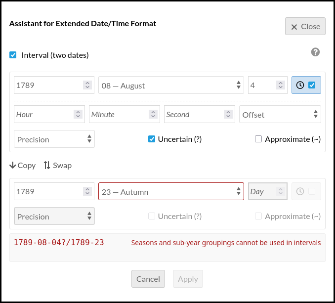

Data Type Extended Date Time (module for Omeka S)
=================================================

[Data Type Extended Date Time] is a module for [Omeka S] that adds a data type
for the [Extended Date/Time Format] (EDTF, ISO 8601-2:2019), allowing to
describe dates and times with precision, uncertainty, and approximation.




About EDTF
----------

The [Extended Date/Time Format] (EDTF) is a standard (ISO 8601-2:2019) for
representing dates and times that goes beyond conventional date formats. It was
developed by the Library of Congress and is widely used in cultural heritage,
archives, and digital humanities.

For the full specification, see the [Library of Congress EDTF page] or the [whole iso standard] (paywall).

Unlike simple date formats (e.g. `2024-03-15`), EDTF can express:

- Uncertain dates: `1789?` (the year 1789, but uncertain)
- Approximate dates: `1789~` (approximately 1789)
- Uncertain and approximate: `1789%` (uncertain and approximate)
- Intervals: `1964/2008` (from 1964 to 2008)
- Open intervals: `1964/..` (from 1964, ongoing)
- Reduced precision: `198X` (the 1980s), `19XX` (the 1900s or the 20th century)
- Seasons: `2001-21` (spring 2001)
- Sets: `[1667,1668,1670..1672]` (one of 1667, 1668, or 1670 to 1672)
- Unspecified digits: `156X-12-25` (December 25 of a 1560s year)
- Negative years: `Y-17E7` (170 million years ago)

Common examples in cultural heritage:

| EDTF value         | Meaning                                |
|--------------------|----------------------------------------|
| `2024-03-15`       | March 15, 2024                         |
| `2024-03`          | March 2024                             |
| `2024`             | The year 2024                          |
| `1789?`            | 1789 (uncertain)                       |
| `1789~`            | Approximately 1789                     |
| `1789%`            | 1789 (uncertain and approximate)       |
| `1900/1999`        | From 1900 to 1999                      |
| `../1871`          | Open start, until 1871                 |
| `/1871`            | Unknown start, ends at 1871            |
| `1871/..`          | From 1871, open end (ongoing)          |
| `1871/`            | From 1871, unknown end                 |
| `198X`             | The 1980s                              |
| `2001-21`          | Spring 2001                            |
| `-0489-09-07`      | 12 September 490 BCE Julian (Marathon) |

### Astronomical year numbering

EDTF inherits the proleptic Gregorian calendar with **astronomical year numbering**.
So there is a year `0000`, equal to 1 BCE.

Therefore:

- `0000` = 1 BCE
- `-0001` = 2 BCE
- `-0300` = 301 BCE
- `-0999` = 1000 BCE

This convention is used everywhere in the module:

- parsing and validation (via the `ProfessionalWiki/EDTF` library);
- JSON-LD output (`@value` keeps the literal EDTF string);
- the `data_type_edtf` index table, where the packed date column stores the
  astronomical year directly: `-0300-01-01` becomes `(-300 + 10^14) * 10000 + 100 + 1`,
  which sorts naturally before `-0299-01-01`;
- advanced-search and facet queries, which encode the user-supplied EDTF string
  through the same bounds function, so no BCE ↔ astronomical conversion is ever
  required.

References:
- ISO 8601-1:2019 §4.1.2.4 and §5.2.2;
- Library of Congress EDTF draft (2012), §4 « Date ».

### Century representation

Year ranges with reduced precision (EDTF `XX`/`XXX` unspecified digits) are
humanized using the ordinal convention:

| EDTF    | Humanized       | Period covered                      |
|---------|-----------------|-------------------------------------|
| `198X`  | 1980s           | 1980–1989                           |
| `19XX`  | 20th century    | 1900–1999                           |
| `02XX`  | 3rd century     | 0200–0299                           |
| `1XXX`  | 2nd millennium  | 1000–1999                           |
| `-03XX` | 4th century BCE | -0300 to -0399 (301 BCE to 400 BCE) |

Note that the ordinal numbering follows the common "1900s = 20th century"
convention (years ending in 0). The strict Gregorian convention
("1901–2000 = 20th century") is not used.

An alternative literal display ("the 1900s" instead of "20th century") is
planned as a user-configurable setting (see TODO).

Nevertheless, in an historical context, you may prefer to use intervals:

| EDTF        | Humanized    | Period covered |
|-------------|--------------|----------------|
| `1601/1700` | 17th century | 1601 to 1700   |

### Half-centuries and other sub-century periods

EDTF does not define a native syntax for expressing half-centuries,
quarter-centuries, half-decades, start/middle/end. The Level 2 sub-year
groupings (codes 21–41) replace the month position in `YYYY-MM` and
therefore only split a year, not a century.

To express for example "2nd half of the 17th century", use an explicit interval:

| Natural expression            | EDTF                                        |
|-------------------------------|---------------------------------------------|
| 2nd half of the 17th century  | `1651/1700`                                 |
| 1st half of the 17th century  | `1601/1650`                                 |
| 1st quarter of the 1800s      | `1801/1825`                                 |
| 1950s only                    | `1950/1959` or `195X`, depending on context |

The French humanizer automatically detects century subdivisions (thirds,
quarters, and halves) and renders them with natural French labels, using base-0
conventions (1900–1999 = 20ᵉ siècle):

| EDTF          | French rendering              | Period                    |
|---------------|-------------------------------|---------------------------|
| `17XX`        | 18ᵉ siècle                    | Full century (1700–1799)  |
| `1700/1733`   | début du 18ᵉ siècle           | 1st third                 |
| `1734/1766`   | milieu du 18ᵉ siècle          | 2nd third                 |
| `1767/1799`   | fin du 18ᵉ siècle             | 3rd third                 |
| `1700/1724`   | 1ᵉʳ quart du 18ᵉ siècle       | 1st quarter               |
| `1725/1749`   | 2ᵉ quart du 18ᵉ siècle        | 2nd quarter               |
| `1750/1774`   | 3ᵉ quart du 18ᵉ siècle        | 3rd quarter               |
| `1775/1799`   | 4ᵉ quart du 18ᵉ siècle        | 4th quarter               |
| `1700/1749`   | 1ʳᵉ moitié du 18ᵉ siècle      | 1st half                  |
| `1750/1799`   | 2ᵈᵉ moitié du 18ᵉ siècle      | 2nd half                  |

These patterns follow the recommandation of the Joconde cataloguing conventions
of the French Ministère de la Culture, where century subdivisions are encoded as
year intervals. See [Joconde, Portail des collections des musées de France],
p. 24, for the full specification.

### Open vs unknown interval sides

ISO 8601-2:2019 distinguishes two kinds of missing interval bounds:

| Syntax     | Kind    | Meaning                                               |
|------------|---------|-------------------------------------------------------|
| `../1871`  | Open    | No definite start; extends indefinitely into the past |
| `/1871`    | Unknown | A start date exists but is not known                  |
| `1871/..`  | Open    | No definite end; ongoing, extends indefinitely        |
| `1871/`    | Unknown | An end date exists but is not known                   |

The key difference: "open" means the bound does not exist (infinite), "unknown"
means the bound exists but is undocumented.

In French, the optional humanizer "Usage courant" renders the distinction
through the natural meaning of the French words:

| EDTF       | French rendering   | Implication                                              |
|------------|--------------------|----------------------------------------------------------|
| `../1871`  | jusqu’en 1871      | Continuous process, no start => open                     |
| `/1871`    | avant 1871         | Something happened before, we don’t know when => unknown |
| `1871/..`  | depuis 1871        | Ongoing, no end => open                                  |
| `1871/`    | après 1871         | There is an end but we don’t know it => unknown          |

When an open/unknown interval side is combined with unspecified digits (centuries,
decades), the humanizer produces a natural "début/fin" expression:

| EDTF        | French rendering            | Meaning                      |
|-------------|-----------------------------|------------------------------|
| `19XX/..`   | début du 20ᵉ siècle         | Beginning of the 20th c.     |
| `../19XX`   | fin du 20ᵉ siècle           | End of the 20th c.           |
| `192X/..`   | début des années 1920       | Beginning of the 1920s       |
| `../192X`   | fin des années 1920         | End of the 1920s             |
| `1XXX/..`   | début du 2ᵉ millénaire      | Beginning of the 2nd mill.   |

In the dialog assistant, the distinction is controlled by a checkbox ("Unknown side")
that appears when exactly one side of an interval is left empty. Unchecked
(default) produces `..` (open); checked produces an empty side (unknown).

### Allowed characters in EDTF values

| Character    | Usage                                              |
|--------------|----------------------------------------------------|
| `0`–`9`      | Year, month, day, hour, minute, second             |
| `-`          | Date separator, negative year/offset               |
| `:`          | Time separator (hours:minutes:seconds)             |
| `T`          | Date/time separator                                |
| `Z`          | UTC timezone                                       |
| `+`          | Positive timezone offset                           |
| `?`          | Uncertain                                          |
| `~`          | Approximate                                        |
| `%`          | Uncertain and approximate                          |
| `X`          | Unspecified digit (`198X`, `19XX`)                 |
| `/`          | Interval separator (start/end)                     |
| `..`         | Open start/end (extending indefinitely)            |
| `[` `]`      | Set (one of)                                       |
| `{` `}`      | Inclusive set (all members)                        |
| `,`          | Set member separator                               |
| `Y`          | Long year prefix (`Y17000`, `Y-17E7`)              |
| `E`          | Exponent for scientific notation                   |
| `S`          | Significant digits (`1950S2`)                      |
| `(` `)`      | Group qualification (level 2)                      |
| `21`–`24`    | Seasons (spring, summer, autumn, winter)           |
| `25`–`41`    | Sub-year groupings (quarter, semester, etc.)       |


Features
--------

### EDTF data type

The module adds the data type `EDTF Date/Time` (`edtf`) that can be assigned to
any property in a resource template. Values are validated in real-time in the
resource form, and stored in a dedicated index table for efficient querying and
sorting.

When displayed, EDTF values are humanized, for example `1789~` becomes "1789 (approximately)").

### Advanced search

EDTF fields appear in the advanced search form for items, allowing to filter
resources by:

- Date on or after: find resources with a date greater than or equal to a given
  EDTF value
- Date on or before: find resources with a date less than or equal to a given
  EDTF value

### Sorting

Resources can be sorted by any property using the EDTF data type, both in the
admin interface and on public sites.

### Batch conversion

Existing literal values can be batch-converted to EDTF. Use the batch edit
action on items: select the property and the target EDTF data type. Invalid
values are skipped and logged.

### CSV Import

The EDTF data type is registered for [CSV Import], mapped to the literal
adapter.

### Data Visualization integration

When the [Datavis] module is installed, the following are available:

- Dataset types: count items time series, count items property values time
  series
- Diagram types: line chart time series, histogram time series, line chart time
  series grouped

### Faceted Browse integration

When the [Faceted Browse] module is installed, seven facet types are available:

- Date after
- Date before
- Date in interval

### JSON-LD output

When a resource is exposed as JSON-LD, the `@type` of EDTF values is chosen to
be as precise as possible:

| EDTF value example            | Returned `@type`                              |
|-------------------------------|-----------------------------------------------|
| `2024-03-15`                  | `http://www.w3.org/2001/XMLSchema#date`       |
| `2024-03`                     | `http://www.w3.org/2001/XMLSchema#gYearMonth` |
| `2024`, `-0500`               | `http://www.w3.org/2001/XMLSchema#gYear`      |
| `2024-03-15T10:30:00Z`        | `http://www.w3.org/2001/XMLSchema#dateTime`   |
| Qualifiers, unspecified, sets | `http://id.loc.gov/datatypes/edtf/EDTF`       |
| Seasons, intervals, long year | `http://id.loc.gov/datatypes/edtf/EDTF`       |

The Library of Congress maintains the EDTF datatypes scheme at:

- [EDTFScheme overview](https://id.loc.gov/datatypes/EDTFScheme.html)
- [EDTF (all levels)](https://id.loc.gov/datatypes/edtf/EDTF.html)
- [EDTF Level 0](https://id.loc.gov/datatypes/edtf/EDTF-level0.html)
- [EDTF Level 1](https://id.loc.gov/datatypes/edtf/EDTF-level1.html)
- [EDTF Level 2](https://id.loc.gov/datatypes/edtf/EDTF-level2.html)

Related discussions:

- [WikibaseEdtf#13: Change RDF type xsd:edtf](https://github.com/ProfessionalWiki/WikibaseEdtf/issues/13)
- [Islandora/documentation#916: EDTF meta-issue](https://github.com/Islandora/documentation/issues/916)


Installation
------------

See general end user documentation for [installing a module].

This module requires the module [Common], that should be installed first.

It requires PHP 7.4+ and the Composer dependency [professional-wiki/edtf].

* From the zip

Download the last release [DataTypeEdtf.zip] from the list of releases, and
uncompress it in the `modules` directory.

* From the source and for development

If the module was installed from the source, rename the name of the folder of
the module to `DataTypeEdtf`, go to the root of the module, and run:

```sh
cd modules/DataTypeEdtf
composer install --no-dev
```

The JavaScript library [EDTF.js] does not provide a browser-ready build. To
rebuild the vendor bundle file `asset/vendor/edtf/edtf.js`:

```sh
cd modules/DataTypeEdtf
npm install --no-save edtf
echo 'import { parse } from "edtf"; window.edtf = { parse };' \
    | npx esbuild --bundle --format=iife --platform=browser --outfile=asset/vendor/edtf/edtf.js
rm -rf node_modules
```

Then install it like any other Omeka module.

* For test

The module includes a comprehensive test suite with unit and functional tests.
Run them from the root of Omeka:

```sh
vendor/bin/phpunit -c modules/DataTypeEdtf/phpunit.xml --testdox
```


Migration from the legacy [Edtf Data Type] module
-----------------------------------------------

The older module `EdtfDataType` and this module can be installed side-by-side:
all collision points (namespace, data type id, table name, routes, config keys,
JS globals) have been resolved by the rename. The migration is exposed as a
button in the `DataTypeEdtf` configuration form.

The migration keeps all stored EDTF strings intact in the Omeka `value` column:
no item is modified. Three things change, which API or SPARQL consumers must be
aware of:

1. Data type id in the database: `edtf:date` => `edtf`.
2. JSON-LD `@type` returned by the API: upgraded from `xsd:string` (for every
   value) to precise XSD types (`xsd:date`, `xsd:gYear`, `xsd:gYearMonth`,
   `xsd:dateTime`) for pure dates, and to the Library of Congress EDTF URI
   (`http://id.loc.gov/datatypes/edtf/EDTF`) for advanced forms (qualifiers,
   seasons, intervals, sets, long years).
3. Advanced-search query format flattened from `edtf[date][gte][<pid>]=...` to
  `edtf[gte][<pid>]=...`.

To migrate, just click the button in the config form of the module.

For complex environments or to script migration, a command-line script is also
provided:

```sh
cd /path/to/omeka-s
php modules/DataTypeEdtf/data/scripts/migrate-from-legacy.php
```


Usage
-----

### Configure settings

For display, some options are available in main settings and site settings.
Check them first, in particular the choice for the calendar.

### Setting up a property with EDTF

1. Go to Resource templates in the admin interface.
2. Edit or create a template.
3. For the desired property (e.g. `dcterms:date`), select `EDTF Date/Time` as
   the data type.
4. Save the template.

When editing a resource using this template, the property field will validate
EDTF input in real-time and display any syntax errors.

### Searching by EDTF values

In the advanced search form for items, EDTF filter fields allow to search for
resources with dates on or after and/or on or before a given value.

Via the API, use the `edtf` query parameter:

```
/api/items?edtf[gte][<propertyId>]=1900&edtf[lte][<propertyId>]=1999
```

### Batch converting values to EDTF

1. Select items in the admin browse view.
2. Click Batch actions > Edit selected.
3. In the Convert to EDTF section, select the property and the data type.
4. Click Save. Invalid values are skipped and logged.

### Sorting by EDTF values

In the browse view, EDTF sort options appear automatically for any property
that has the EDTF data type assigned in a resource template.


TODO
----

- [x] Implement `ConversionTargetInterface` (Omeka S 4.2+) on `Edtf` data type to use the native batch conversion system instead of the custom `ConvertToEdtf` mechanism.
- [ ] PR/fork to fix php validator `ProfessionalWiki/EDTF`:
  - Accepts calendar-impossible dates like `1980-11-31` and `1980-02-30` (days greater than days in month);
  - Accepts qualifiers on seasons (e.g., `2020-21?`);
  - Accepts seasons/sub-year groupings in intervals (ex: `2020-21/2025-22`).
- [ ] PR/fork/rewrite to fix js `edtf.js`:
  - Accepts `2023-02-29` on non-leap years;
  - Accepts reversed intervals like `1990/1980`;
  - Accepts `../..` (both sides unknown).
- [ ] Make more humanization configurable via settings: ordinal "The 20th century" or literal "The 1900s", BCE/BC suffix, month format, etc.
- [ ] Apply the same settings to both JS (dialog preview) and PHP (`Edtf::render()` via `ProfessionalWiki/EDTF`).
- [ ] Differentiate EDTF Level 0/1/2 uris in `getJsonLd()` instead of always returning generic `http://id.loc.gov/datatypes/edtf/EDTF`?


Warning
-------

Use it at your own risk.

It's always recommended to backup your files and your databases and to check
your archives regularly so you can roll back if needed.


Troubleshooting
---------------

See online issues on the [module issues] page.


License
-------

### Module

The Omeka source code is distributed under the GNU General Public License,
version 3 (GPLv3). The full text of this license is given in the license file.

The Omeka name is a registered trademark of the Corporation for Digital
Scholarship.

Third-party copyright in this distribution is noted where applicable.

All rights not expressly granted are reserved.

### Library

- [EDTF.js] is licensed under the terms of the BSD-2-Clause license.
- [professional-wiki/edtf] is licenced under GLPv2 or later.


Copyright
---------

- Copyright 2018-2023 [Corporation for Digital Scholarship], Vienna, Virginia, USA (NumericDataTypes)
- Copyright 2023 [University of Warwick]
- Copyright 2026 Daniel Berthereau (see [Daniel-KM] on GitLab)

This module is based on module [Numeric Data Types] of the Omeka Team and on the
[previous module] of Steve Ranford for [University of Warwick]. It was upgraded
for the [Musee de Bretagne], currently under a proprietary software (application).


[Data Type Extended Date Time]: https://gitlab.com/Daniel-KM/Omeka-S-module-DataTypeEdtf
[Data Type EDTF]: https://gitlab.com/Daniel-KM/Omeka-S-module-DataTypeEdtf
[Omeka S]: https://omeka.org/s
[installing a module]: https://omeka.org/s/docs/user-manual/modules/#installing-modules
[Extended Date/Time Format]: https://www.loc.gov/standards/datetime/
[Library of Congress EDTF page]: https://www.loc.gov/standards/datetime/
[whole iso standard]: https://www.iso.org/obp/ui/#iso:std:iso:8601:-1:ed-1:v1:en
[Joconde, Portail des collections des musées de France]: https://www.culture.gouv.fr/content/download/197593/file/methode.pdf
[professional-wiki/edtf]: https://github.com/ProfessionalWiki/EDTF
[Common]: https://gitlab.com/Daniel-KM/Omeka-S-module-Common
[CSV Import]: https://omeka.org/s/modules/CSVImport/
[Datavis]: https://omeka.org/s/modules/Datavis/
[Faceted Browse]: https://omeka.org/s/modules/FacetedBrowse/
[Numeric Data Types]: https://omeka.org/s/modules/NumericDataTypes/
[Edtf Data Type]: https://github.com/digihum/omeka-s-module-edtf-data-type
[module issues]: https://gitlab.com/Daniel-KM/Omeka-S-module-DataTypeEdtf/-/issues
[EDTF.js]: https://github.com/inukshuk/edtf.js
[Corporation for Digital Scholarship]: http://digitalscholar.org
[University of Warwick]: https://warwick.ac.uk/digitalhumanities
[previous module]: https://github.com/Warwick-Digital-Humanities/EdtfDataType
[Musee de Bretagne]: https://musee-bretagne.fr
[Daniel-KM]: https://gitlab.com/Daniel-KM "Daniel Berthereau"
